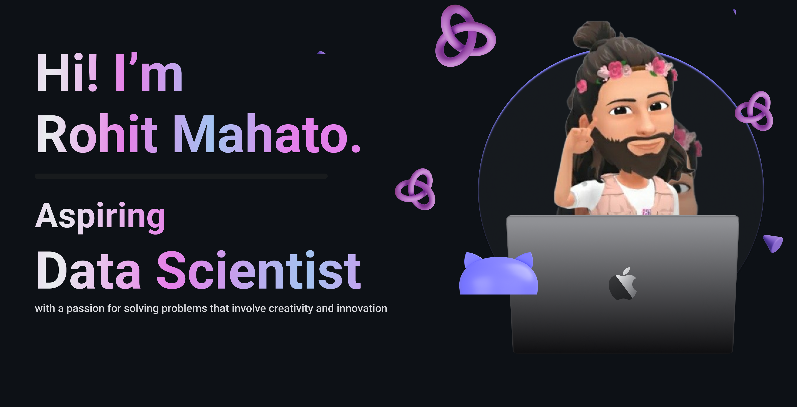

<!-- <h2 align='center'>Rohit Mahato @ r-mahato11
</h2>
<p align='center'><b>Purusing Graduation Student at GS Moze College of Engineering at Pune</b></p> -->

<h2>Hey! 👋</h2>

[](https://github.com/r-mahato11) [](https://github.com/r-mahato11?tab=followers)

I'm Rohit Mahato! 
- <i>Currently:</i> BE CS Student at GS Moze College of Engineering at Pune. 
- <i>Previously:</i> Diploma CS Student at Ajeenkya DYP College of Engineering at Pune.

<h2>💻 I'm Currently working on</h2>

- 
- 

## 🛠️ My Favourite tools

### 👨‍💻 Programming languages

<p>
    <a href="#"></a>
    <a href="#"></a>
    <a href="#"></a>
    <a href="#"></a>
    <a href="#"></a>
    <a href="#"></a>
    <a href="#"></a>
    <a href="#"></a>
    <a href="#"></a>
    <a href="#"></a>
    <a href="#"></a>
</p>

### 🧰 Frameworks and libraries

<p>
    <a href="#"></a>
    <a href="#"></a>
    <a href="#"></a>
    <a href="#"></a>
    <a href="#"></a>
    <a href="#"></a>
</p>

### 🗄️ Databases and Cloud Hosting

<p>
    <a href="#"></a>
    <a href="#"></a>
    <a href="#"></a>
    <a href="#"></a>
</p>

### 💻 Software and tools

<p>
    <a href="#"></a>
    <a href="#"></a>
    <a href="#"></a>
    <a href="#"></a>
    <a href="#"></a>
    <a href="#"></a>
    <a href="#"></a>
    <a href="#"></a>
</p>

<h2>👀 Stats</h2>
<details>
  <summary>&nbsp;&nbsp;<b>🔥 GitHub Contributions Streak</summary>
  <br/>
  
  <p align="center">
  <b><em>GitHub Stats:</em></b> <br/>
     <br/><br/>
  </p>
</div>
<div>
[](https://wakatime.com/@0f3d8544-3446-40bb-987d-b1a8ed7d2cff) <b>&nbsp; coded, since JAN 22 2021</b>

📊 <b>This Week I Spent My Time On</b>

<!--START_SECTION:waka-->
```text
HTML         5 hrs 3 mins    ███████████▒░░░░░░░░░░░░░   44.70 % 
Java         4 hrs 35 mins   ██████████░░░░░░░░░░░░░░░   40.59 % 
JavaScript   1 hr 34 mins    ███▒░░░░░░░░░░░░░░░░░░░░░   13.85 % 
CSS          3 mins          ░░░░░░░░░░░░░░░░░░░░░░░░░   00.55 % 
XML          2 mins          ░░░░░░░░░░░░░░░░░░░░░░░░░   00.31 % 
```
<!--END_SECTION:waka-->
<details/>

<h2> About Rohit Mahato⚡:</h2>

I'm a Purusing Graduation Student at GS Moze College of Engineering at Pune, Maharashtra. Outside Tech, I love to read, enjoy music and explore nature outdoors. If you are around Pune, drop an email and let's catch-up over Coffee!
 
- Check out my Blog: [https://r-mahato11.com](https://r-mahato11.com)
- Know more about me: [About r-mahato11](https://r-mahato11.com/pages/about)
- Write to me: [ConnectWith@r-mahato11.com](mailto:ConnectWith@r-mahato11.com)

<h2>📫 How to reach me:</h2>

<a href="mailto:ConnectWith@r-mahato11.com"></a> <a href="https://www.linkedin.com/in/r-mahato11/"></a>
